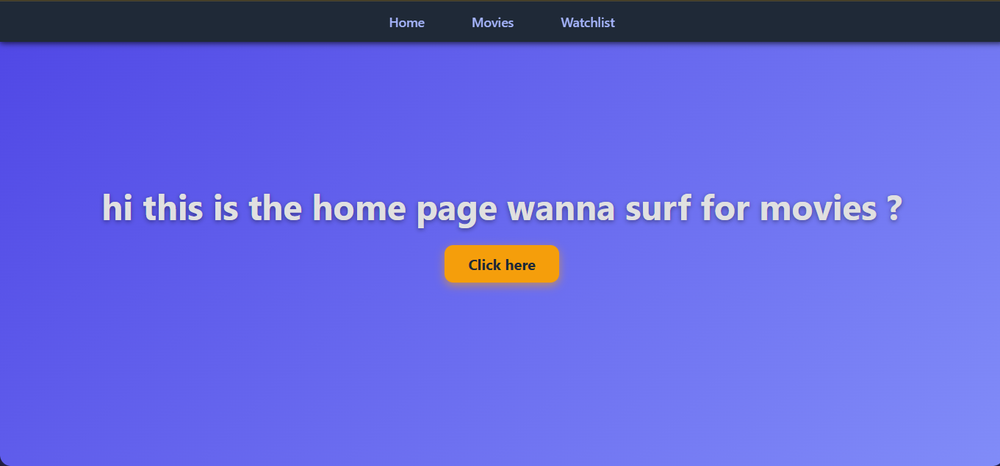
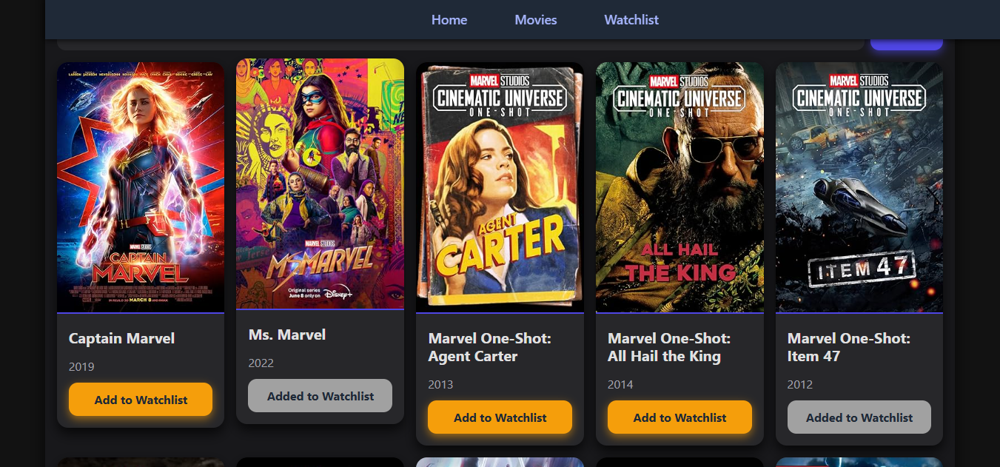
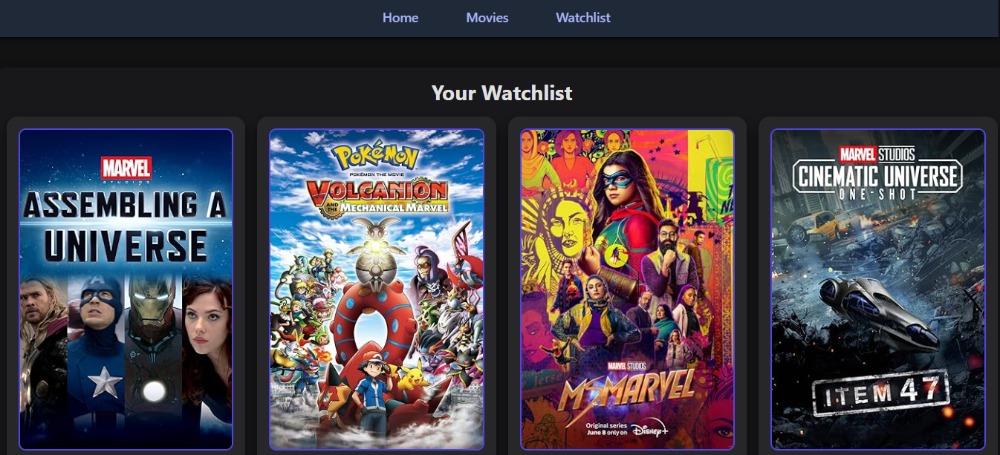

# Movies Hub

Movies Hub is a modern web application that allows users to browse, search, and manage their favorite movies. It features a sleek and responsive design with a dark theme and intuitive navigation.

## Features

- **Home Page:** Welcome landing page with a call-to-action button to explore movies.
- **Movies Listing:** Browse a wide collection of movies with search functionality to find movies by title.
- **Movie Details:** View detailed information about each movie including poster, title, and release year.
- **Watchlist Management:** Add movies to your personal watchlist for easy access later.
- **Remove from Watchlist:** Easily remove movies from your watchlist.
- **Pagination:** Navigate through multiple pages of movies seamlessly.
- **Responsive Design:** Works well on desktop and mobile devices.
- **Dark Theme:** Modern dark color scheme for comfortable viewing.

## Screenshots

### Home Page



### Movies Listing



### Watchlist



## Installation

1. Clone the repository:
   ```
   git clone <repository-url>
   ```
2. Navigate to the project directory:
   ```
   cd moviehub
   ```
3. Install dependencies:
   ```
   npm install
   ```
4. Start the development server:
   ```
   npm start
   ```
5. Open your browser and go to `http://localhost:3000` to view the app.

## Usage

- Use the navigation bar to switch between Home, Movies, and Watchlist pages.
- Search for movies by typing in the search bar and clicking the search button.
- Click "Add to Watchlist" on any movie card to save it.
- Visit the Watchlist page to view and manage your saved movies.

## Technologies Used

- React
- CSS Modules
- JavaScript (ES6+)
- Node.js and npm

## License

This project is licensed under the MIT License.
